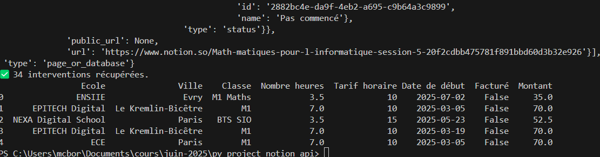
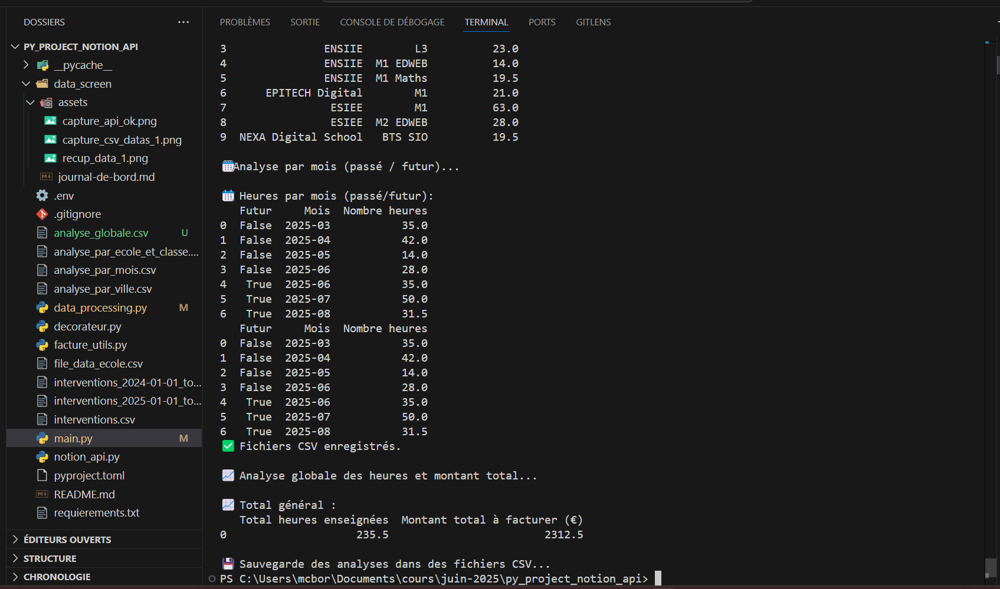
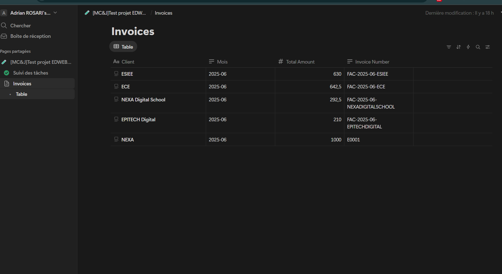
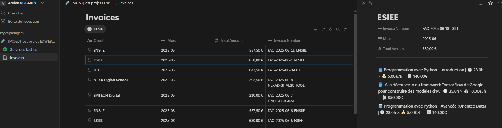
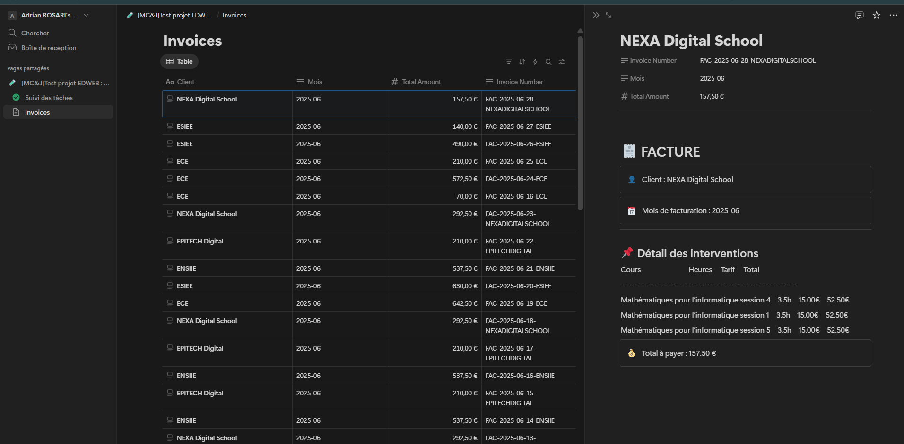
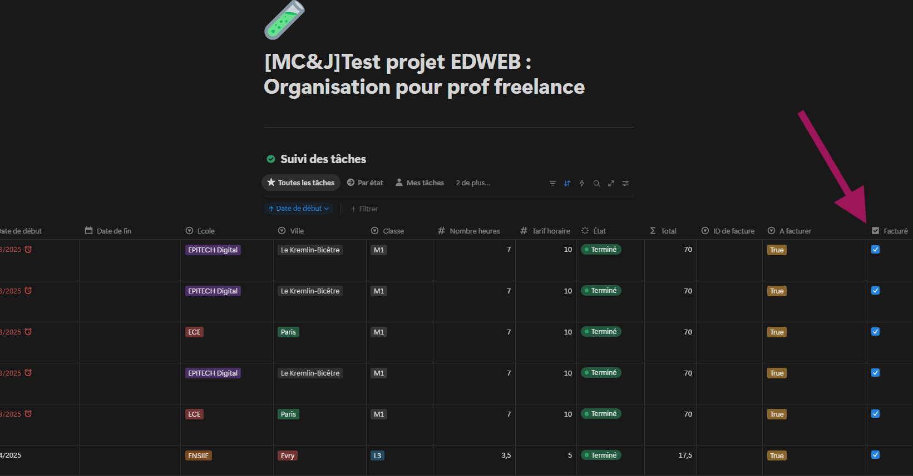

# 📘 Journal de bord - Projet Python x API Notion Marie-Charlotte et Jérémy

## 📅 Plan 

| Étape         | Description                                     | Statut     | Date         |
|-------------- |-------------------------------------------------|:------------:|--------------|
| ✅ Étape 1   | Connexion à l'API Notion via fichier `.env`     | Terminé    | 2025-06-12   |
| ✅ Étape 2   | Fonction `query_unbilled_entries()`             | Terminé    | -            |
| ✅ -         | Analyse avec `pandas`                           | Terminé    | 2025-06-12   |
| ✅ Étape 3   | Génération de factures + export CSV             | Terminé    | -            |
| ✅ -         | Ecriture des factures sur notion                | Terminé    | 2025-06-12   |
| ✅ Étape 4   | Mise en page : generate_invoice_blocks          | Terminé    | -            |
| ✅ Étape 5   | Mise en page : def create_invoice_page          | Terminé    | -            |
| ✅ Étape 6   | Mise à joour : mark_as_billed(pages)            | Terminé    | -            |
| ✅ Étape 7   | Orchestrer tout le processus dans le main       | Terminé    | 2025-06-12   |

---

## 📁 Structure du projet

py_project_notion_api/
│
├── .env                         # 🔐 Variables d’environnement (token Notion, ID DB)
├── .gitignore                   # 📄 Fichiers à ignorer par Git
├── pyproject.toml               # ⚙️ Dépendances (format Poetry ou standard)
├── README.md                    # 📘 Description du projet
├── main.py                      # 🚀 Script principal à lancer
│
├── src/                         # 🧠 Code source Python
│   ├── data_processing.py       # 📊 Fonctions d’analyse et extraction pandas
│   ├── decorateur.py            # 🪄 Déco pour logs / debug
│   ├── facture_utils.py         # 🧾 Génération et envoi de factures Notion
│   └── notion_api.py            # 📡 (à renommer .py si script d’API)
│
└── data_screen/                 # 📸 Données et captures
    └── assets/
        ├── CSV/                 # 📂 Exports d’analyses CSV
        │   ├── fichiers_csv.csv
        │   └── ...
        ├── capture_api_ok.png                # ✅ Connexion API réussie
        ├── capture_db_invoices_remplies.png  # 🧾 Factures dans Notion
        ├── capture_facture_notion.png        # 📄 Détail d'une facture
        └── ...                               # 🖼️ Autres captures utiles

---

⚙️ Installation & lancement
1. Cloner le projet ou copier les fichiers dans un dossier local. 
2. Installer les dépendances :

```BASH
pip install -r requirements.txt
```

3. Créer un fichier .env avec :

```BASH
NOTION_TOKEN=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
DB_INTERVENTIONS_ID=20f2cdbb475781539762e04bffc6a0ba
DB_INVOICES_ID=20f2cdbb475781bebaacd0a5be074411
```

4. Lancer le script principal :

```BASH
python main.py
```
---

# 🧠 Étapes principales du projet

## Étape 0 & 1 – Configuration de l’environnement & Définir les entêtes pour l’API Notion

### ✅ Fonctionnalités implémentées

- [x] Connexion sécurisée à l\'API Notion via clé secrète
- [x] Requête filtrée selon la colonne **Facturé** + plage de dates
- [x] Analyse des résultats avec `pandas`
- [x] Export en `.csv` automatique

---

### 🧪 Tests & validation

- 🔄 Vérification manuelle dans le terminal (print & logs)
- ✅ Code retour HTTP 200 → données bien récupérées


### 📸 Capture – Connexion à l'API réussie

> Exemple de connexion réussie à Notion, avec récupération des propriétés de la base :


---


## Étape 2 – Fonction pour récuperer et trier les datas

> query_unbilled_entries(date_begin : str, date_end : str, a_ete_facture : bool)

> Requête sur la base Notion filtrée par date et statut "Facturé".

> Transformation des résultats en pandas.DataFrame pour faciliter l\'analyse.

### 🔍 Code – Requête des interventions non facturées + CSV

```python
def query_unbilled_entries(date_begin: str, date_end: str, a_ete_facture: bool):
    print("📡 Début de la requête vers Notion...")

    # Construction dynamique du filtre
    filters = [
        {
            "property": "Date de début",
            "date": {"on_or_after": date_begin}
        },
        {
            "property": "Date de début",
            "date": {"before": date_end}
        }
    ]

    if a_ete_facture is not None:
        filters.insert(0, {
            "property": "Facturé",
            "checkbox": {"equals": a_ete_facture}
        })

    query = {"filter": {"and": filters}}

    response = requests.post(
        f"https://api.notion.com/v1/databases/{DB_ID}/query",
        headers=HEADERS,
        json=query
    )

    print(f"📦 Code de retour API : {response.status_code}")
    if response.status_code != 200:
        print("❌ Erreur API :", response.text)
        response.raise_for_status()

    results = response.json().get("results", [])
    if not results:
        print("⚠️ Aucune donnée trouvée.")
        return []

    # ➕ Export CSV avec pandas
    df = pd.json_normalize(results)
    csv_filename = f"interventions_{date_begin}_to_{date_end}.csv"
    df.to_csv(csv_filename, index=False)
    print(f"✅ CSV généré : {csv_filename}")

    return results
```


### 🧭 Prochaines étapes

➡️ Nettoyage et transformation des données avec `pandas`
➡️ Préparation des templates de factures (PDF ou CSV)
➡️ Documentation finale & README complet

---

###  🔍 Questions pour analyse :
### récupérer les résultats et montrez via des DataFrames :

par ville, le nombre d’écoles, le nombre d’heures données et la somme à facturer

> Exemple de la premiere récuperation data triées:




### 🔍 Code – Extrait du code de la premiere récuperation data triées + CSV

```python
# Fonction pour extraire les interventions dans un DataFrame
def extraire_interventions(results):
    lignes = []
    for item in results:
        props = item["properties"]

        # Extraction simple des propriétés utiles
        ligne = {
            "Ecole": props["Ecole"]["select"]["name"] if props["Ecole"]["select"]["name"] else "",
            "Ville": props["Ville"]["select"]["name"] if props["Ville"]["select"] else "",
            "Classe": props["Classe"]["select"]["name"] if props["Classe"]["select"]["name"] else "",
            "Nombre heures": props["Nombre heures"]["number"],
            "Tarif horaire": props["Tarif horaire"]["number"],
            "Date de début": props["Date de début"]["date"]["start"],
            "Facturé": props["Facturé"]["checkbox"]
        }

        # Calcul du montant à facturer
        ligne["Montant"] = ligne["Nombre heures"] * ligne["Tarif horaire"] if ligne["Nombre heures"] and ligne["Tarif horaire"] else 0

        lignes.append(ligne)

    return pd.DataFrame(lignes)
    ```

  > Exemple de la premiere récuperation data triées:




## Analyses avec pandas - data_processing.py :
---
### Analyses créées :

 par ville : nombre d'écoles, heures totales, montant à facturer.

 par école et par classe.

 par mois : heures dans le passé / le futur.

 globale : heures totales & montant à facturer.

---

```PYTHON
import pandas as pd
from datetime import datetime

# Fonction pour extraire les interventions dans un DataFrame
def extraire_interventions(results):
    lignes = []
    for item in results:
        props = item["properties"]

        ligne = {
            "Ecole": props["Ecole"]["select"]["name"] if props["Ecole"]["select"] else "",
            "Ville": props["Ville"]["select"]["name"] if props["Ville"]["select"] else "",
            "Classe": props["Classe"]["select"]["name"] if props["Classe"]["select"] else "",
            "Nombre heures": props["Nombre heures"]["number"],
            "Tarif horaire": props["Tarif horaire"]["number"],
            "Date de début": props["Date de début"]["date"]["start"],
            "Facturé": props["Facturé"]["checkbox"]
        }

        ligne["Montant"] = (ligne["Nombre heures"] or 0) * (ligne["Tarif horaire"] or 0)
        lignes.append(ligne)

    df = pd.DataFrame(lignes)
    df.to_csv("file_data_ecole.csv", index=False)
    print("✅ Fichier CSV créé : file_data_ecole.csv")
    return df
    
# Analyse par ville : nombre d'écoles, heures, montant
def analyse_par_ville(df):
    if df is None or df.empty:
        return pd.DataFrame()
    
    stats = df.groupby("Ville").agg({
        "Ecole": pd.Series.nunique,
        "Nombre heures": "sum",
        "Montant": "sum"
    }).rename(columns={"Ecole": "Nombre d'écoles"})
    
    print("\n📊 Analyse par ville:")
    print(stats)
    return stats.reset_index()


# Analyse par école et classe
def analyse_par_ecole_et_classe(df):
    if df is None or df.empty:
        return pd.DataFrame()
    
    stats = df.groupby(["Ecole", "Classe"]).agg({
        "Nombre heures": "sum"
    }).rename(columns={"Nombre heures": "Total heures"})
    
    print("\n📊 Analyse par école et classe:")
    print(stats)
    return stats.reset_index()

  
# Analyse par mois (passé et futur)
def analyse_par_mois(df):
    if df is None or df.empty:
        return pd.DataFrame()
    
    df["Date de début"] = pd.to_datetime(df["Date de début"])
    df["Mois"] = df["Date de début"].dt.to_period("M")

    aujourd_hui = pd.Timestamp.today()
    df["Futur"] = df["Date de début"] > aujourd_hui

    futur_stats = df.groupby(["Futur", "Mois"])["Nombre heures"].sum().reset_index()
    
    print("\n📆 Heures par mois (passé/futur):")
    print(futur_stats)
    return futur_stats
  
  
  
# Analyse globale : total des heures enseignées et somme à facturer
def analyse_heures_et_montant_total(df):
    if df is None or df.empty:
        return pd.DataFrame()
    
    total_heures = df["Nombre heures"].sum()
    total_montant = df["Montant"].sum()

    resume = pd.DataFrame([{
        "Total heures enseignées": total_heures,
        "Montant total à facturer (€)": total_montant
    }])
    
    print("\n📈 Total général :")
    print(resume)

    return resume
```
---
### 📂 Fichiers générés :

* analyse_par_ville.csv

* analyse_par_ecole_et_classe.csv

* analyse_par_mois.csv

* analyse_globale.csv
---

### Analyse par ville : nombre d'écoles, heures, montant

| Ville      | Nombre d'écoles    | Nombre heures   | Montant     |
|------ |--------|---|-------|
| Evry          | 1  | 56.5    | 537.5   |
| Le Kremlin-Bicêtre | 1 | 21.0    |210.0  |
| Noisy-le-Grand  | 1 | 91.0    | 630.0   |
| Paris | 2 | 67.0  |935.0  |

[📂 Analyse par ville](./assets/CSV/analyse_par_ville.csv)


### Analyse par école et classe
|Ecole|Classe|Total heures|
|---|---|---|
ECE|BTS SIO|3.5
ECE|L3|30.0
ECE|M1|14.0
ENSIIE|L3|23.0
ENSIIE|M1 EDWEB|14.0
ENSIIE|M1 Maths|19.5
EPITECH Digital|M1|21.0
ESIEE|M1|63.0
ESIEE|M2 EDWEB|28.0
NEXA Digital School|BTS SIO|19.5

[📂 Analyse par école et classe](./assets/CSV/analyse_par_ecole_et_classe.csv)


### Analyse par mois (passé et futur)
Futur|Mois|Nombre heures
|---|---|---
False|2025-03|35.0
False|2025-04|42.0
False|2025-05|14.0
False|2025-06|28.0
True|2025-06|35.0
True|2025-07|50.0
True|2025-08|31.5


[📂 Analyse par mois (passé et futur)](./assets/CSV/analyse_par_mois.csv)


### Analyse globale : total des heures enseignées et somme à facturer
|Total heures enseignées     |  Montant total à facturer|
|-------------|-----------------|
|235.5 h	              |        2 312.5 €|

[📂 Analyse globale](./assets/CSV/analyse_globale.csv)


---
## ETAPE 3 : Première fonction de création de factures dans Notion 

### Extrait du code du fichier facture_utils.py :

```PYTHON
def create_invoice_page(client: str, interventions: list, total: float, invoice_number: str):
    if not DB_INVOICES_ID:
        raise ValueError("❌ DB_INVOICES_ID manquant. Vérifie ton .env")

    children = []
    for item in interventions:
        props = item["properties"]
        cours = props["Cours"]["title"][0]["text"]["content"] if props["Cours"]["title"] else "Sans nom"
        heures = props["Nombre heures"]["number"]
        tarif = props["Tarif horaire"]["number"]
        montant = heures * tarif

        ligne = f"{cours} - {heures}h x {tarif}€/h = {montant}€"

        children.append({
            "object": "block",
            "type": "paragraph",
            "paragraph": {
                "rich_text": [{
                    "type": "text",
                    "text": {"content": ligne}
                }]
            }
        })

    payload = {
        "parent": {"database_id": DB_INVOICES_ID},
        "properties": {
            "Client": {
                "title": [{"text": {"content": client}}]
            },
            "Mois": {
                "rich_text": [{"text": {"content": datetime.now().strftime("%Y-%m")}}]
            },
            "Total Amount": {
                "number": total
            },
            "Invoice Number": {
                "rich_text": [{"text": {"content": invoice_number}}]
            }
        },
        "children": children
    }

    print("🛠️ Payload envoyé à Notion :")
    import json
    print(json.dumps(payload, indent=2))

    response = requests.post("https://api.notion.com/v1/pages", headers=HEADERS, json=payload)
    response.raise_for_status()
    print("✅ Facture créée avec succès sur Notion.")
    return response.json()

```

### Capture d'écran de la base de données invoices de Notion


---


❓ Problèmes rencontrés : 
* Nous souhations améliorer le visuel de nos factures avec l\'ajout de décorations de texte. 
* amélioration du nom des factures pour qu\'il soit unique avec une auto incrémentation : invoice_number
* ajout de la devis € dans le tableau Notion

```PYTHON
    mois = datetime.now().strftime("%Y-%m")
    invoice_number = f"FAC-{mois}-{client.replace(' ', '').upper()}"
    print(f"📄 Création de la facture pour {client} ({invoice_number}) : {total} €")
```

##  Étape 4 – Fonction generate_invoice_blocks(...)

🎯 Objectif : Retourner une liste de blocs children à insérer dans une page Notion pour construire une facture propre, structurée et lisible.

💡 On a commencé à rendre plus lisible la facture en modifiant cette ligne : 
```PYTHON
        ligne = f"📘 {cours:<30} | 🕒 {heures:.1f}h × 💰 {tarif:.2f}€/h = 🧾 {montant:.2f}€"
```
 pour notre confort. 


---

Nouvelle fonction d affichage de facture demandé :
```PYTHON

def generate_invoice_blocks(interventions, total, client, mois):
    children = []

    # Bloc titre principal
    children.append({
        "object": "block",
        "type": "heading_1",
        "heading_1": {
            "rich_text": [{
                "type": "text",
                "text": {"content": "FACTURE"}
            }]
        }
    })

    # Infos client et mois
    children.append({
        "object": "block",
        "type": "paragraph",
        "paragraph": {
            "rich_text": [{
                "type": "text",
                "text": {"content": f"Client : {client}"}
            }]
        }
    })
    children.append({
        "object": "block",
        "type": "paragraph",
        "paragraph": {
            "rich_text": [{
                "type": "text",
                "text": {"content": f"Mois : {mois}"}
            }]
        }
    })

    # Ligne de séparation
    children.append({"object": "block", "type": "divider", "divider": {}})

    # Sous-titre
    children.append({
        "object": "block",
        "type": "heading_2",
        "heading_2": {
            "rich_text": [{
                "type": "text",
                "text": {"content": "Détail des interventions"}
            }]
        }
    })

    # En-tête tableau
    children.append({
        "object": "block",
        "type": "paragraph",
        "paragraph": {
            "rich_text": [{
                "type": "text",
                "text": {
                    "content": "Cours | Heures | Tarif | Total\n--- | --- | --- | ---"
                }
            }]
        }
    })

    # Lignes du tableau
    for item in interventions:
        props = item["properties"]
        cours = props["Cours"]["title"][0]["text"]["content"] if props["Cours"]["title"] else "Sans nom"
        heures = props["Nombre heures"]["number"]
        tarif = props["Tarif horaire"]["number"]
        montant = heures * tarif

        ligne = f"{cours} | {heures:.1f}h | {tarif:.2f}€ | {montant:.2f}€"
        children.append({
            "object": "block",
            "type": "paragraph",
            "paragraph": {
                "rich_text": [{
                    "type": "text",
                    "text": {"content": ligne}
                }]
            }
        })

    # Total
    children.append({
        "object": "block",
        "type": "callout",
        "callout": {
            "icon": {"type": "emoji", "emoji": "💰"},
            "rich_text": [{
                "type": "text",
                "text": {"content": f"Total à payer : {total:.2f} €"}
            }]
        }
    })

    return children


```
### 🧾 Exemple de facture générée
Structure typique :


---
❓ Problèmes rencontrés : 
* Réussir à trouver la bonne façon d'écrire cette feature pour correspondre aux attentes de l\'API Notion pour obtenir le résultat escompté.

---

## Étape 5 – Nouvelle version de create_invoice_page(...)
🎯 Objectif : remplacer les children de la fonction actuelle par l’appel à la fonction generate_invoice_blocks.
Remplacement des children = [...] par :

```PYTHON
children = generate_invoice_blocks(interventions, total, client, mois)

```
> Cela permet de construire automatiquement une page Notion bien formatée.


## Étape 6 – Fonction mark_as_billed(pages) Marquer comme facturé
Cette fonction met à jour la propriété Facturé de chaque page intervention 
* envoie une requête PATCH pour chaque page,

* coche la case "Facturé" après émission de la facture.

```Python
def mark_as_billed(pages):
    for page in pages:
        page_id = page["id"]
        requests.patch(
            f"https://api.notion.com/v1/pages/{page_id}",
            headers=HEADERS,
            json={"properties": {"Facturé": {"checkbox": True}}}
        )
```




# Retour sur ce projet : 
## ✅ Fonctionnalités terminées

* Connexion API

* Récupération des interventions

* Analyse avec pandas

* Génération automatique de factures dans Notion

* Marquage des lignes comme facturées

## ❌ Améliorations futures

* Faire les factures uniquement pour les cours donnés => ajouter une sécurité supplémentaire dans le code

* Générer les PDF directement depuis Python.

* Envoyer les factures par e-mail automatiquement.

* Ajouter un champ “commentaire” dans la facture.

## ❓ Problèmes rencontrés

* Nouveau langage à apprendre : PYTHON

* Travail avec une nouvelle API 

* Difficultés à formater les blocs dans Notion : résolu avec generate_invoice_blocks.

* Format du champ title de Notion (cours) : nécessitait ["title"][0]["text"]["content"].

* Génération d’un numéro de facture unique (résolu avec un fichier last_invoice_number.txt).


# 🚀 Lancer le projet

```BASH
python main.py
```