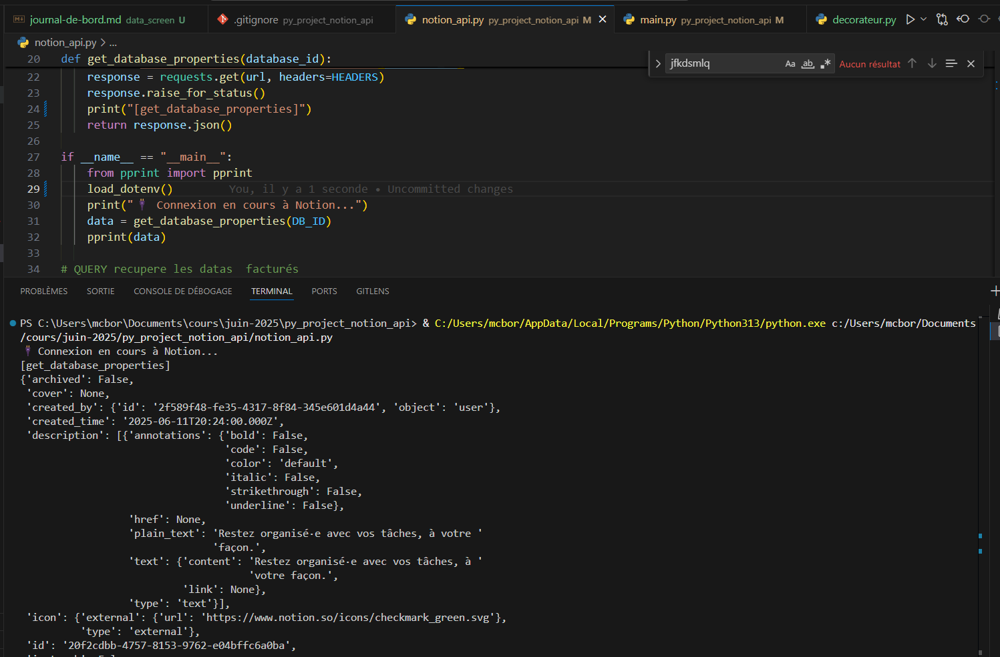

Voici une version **harmonisée, lisible et propre** de ton fichier `journal_de_bord.md` ✅
Je l’ai structuré avec des titres clairs, des emojis pour la lisibilité, un code bien formaté et supprimé les répétitions :

---

```markdown
<!-- Marie-Charlotte et Jérémy -->

# 📘 Journal de bord – Projet Python x API Notion

---

## 📅 Planning prévisionnel

| Étape       | Description                                     | Statut     | Date         |
|-------------|-------------------------------------------------|------------|--------------|
| ✅ Étape 1   | Connexion à l'API Notion via fichier `.env`     | Terminé    | 2025-06-10   |
| ✅ Étape 2   | Fonction `query_unbilled_entries()`             | Terminé    | 2025-06-11   |
| 🔄 Étape 3   | Analyse avec `pandas`                           | En cours   |              |
| ⏳ Étape 4   | Génération de factures + export CSV             | À faire    |              |

---

## 📁 Structure du projet (provisoire)


📦 py\_project\_notion\_api/
├── 📄 .env
├── 📄 main.py
├── 📄 notion\_api.py
├── 📄 journal\_de\_bord.md
└── 📁 assets/
└── 📸 capture\_api\_ok.png


---

## ✅ Fonctionnalités implémentées

- [x] Connexion sécurisée à l'API Notion via clé secrète
- [x] Requête filtrée selon la colonne **Facturé** + plage de dates
- [ ] Analyse des résultats avec `pandas`
- [ ] Export en `.csv` automatique

---

## 🧪 Tests & validation

- 🔄 Vérification manuelle dans le terminal (print & logs)
- ✅ Code retour HTTP 200 → données bien récupérées

---

## ❓ Questions en suspens

- Faut-il détecter des **doublons** avant génération des factures ?
- L'envoi des factures se fait-il **par email** ou en simple export local ?
- Le format du CSV attendu est-il **standardisé** ou libre ?

---

## 📸 Capture – Connexion à l'API réussie

> Exemple de connexion réussie à Notion, avec récupération des propriétés de la base :



---

## 🔍 Code – Requête des interventions non facturées + CSV

```python
def query_unbilled_entries(date_begin: str, date_end: str, a_ete_facture: bool):
    print("📡 Début de la requête vers Notion...")

    # Construction dynamique du filtre
    filters = [
        {
            "property": "Date de début",
            "date": {"on_or_after": date_begin}
        },
        {
            "property": "Date de début",
            "date": {"before": date_end}
        }
    ]

    if a_ete_facture is not None:
        filters.insert(0, {
            "property": "Facturé",
            "checkbox": {"equals": a_ete_facture}
        })

    query = {"filter": {"and": filters}}

    response = requests.post(
        f"https://api.notion.com/v1/databases/{DB_ID}/query",
        headers=HEADERS,
        json=query
    )

    print(f"📦 Code de retour API : {response.status_code}")
    if response.status_code != 200:
        print("❌ Erreur API :", response.text)
        response.raise_for_status()

    results = response.json().get("results", [])
    if not results:
        print("⚠️ Aucune donnée trouvée.")
        return []

    # ➕ Export CSV avec pandas
    df = pd.json_normalize(results)
    csv_filename = f"interventions_{date_begin}_to_{date_end}.csv"
    df.to_csv(csv_filename, index=False)
    print(f"✅ CSV généré : {csv_filename}")

    return results
````

---

## 📌 Remarques techniques

* 📅 Le champ **"Date de début"** a été utilisé comme référence temporelle pour les requêtes.
* 🧹 Les données sont normalisées avant export grâce à `pandas.json_normalize`.
* 🔐 Les variables sensibles (token API, ID base) sont isolées dans le fichier `.env`.

---

## 🧭 Prochaine étape

➡️ Nettoyage et transformation des données avec `pandas`
➡️ Préparation des templates de factures (PDF ou CSV)
➡️ Documentation finale & README complet

---

##  🔍 Questions pour analyse :
### récupérer les résultats et montrez via des DataFrames :
par ville, le nombre d’écoles, le nombre d’heures données et la somme à facturer
